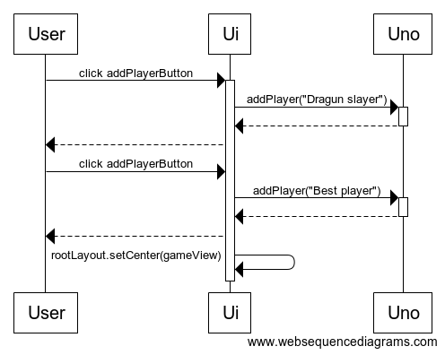

# Arkkitehtuuri

## Sovelluksen rakenne
Ohjelman rakenne koostuu kaksitasoisesta kerrosarkkitehtuurista

ui pakkaus vastaa käyttöliittymästä ja domain vastaa sovelluslogiikasta.

## Käyttöliittymä

Käyttöliitymä koostuu neljästä eri päänäkymästä:
* Alkunäkymä
* Pelaajan lisäysnäkymä
* Pelinäkymä
  * Pelaajan kortit
  * Päällimäinen kortti
  * Pelitiedot (pelaaja, suunta, valittu väri)
  * Värin valinta, jos pelaaja pelaa villi tai villi + nosta neljä -kortin
* Loppunäkymä

Jokaista päänäkymää näytetään yksi kerrallaan. Käyttöliittymän eri näkymät on toteutettuna [ui]() pakkauksessa, luokkina
* [StartView](https://github.com/k0tix/ot-harjoitustyo/blob/master/Unogame/src/main/java/ui/StartView.java)
* [AddPlayerView](https://github.com/k0tix/ot-harjoitustyo/blob/master/Unogame/src/main/java/ui/AddPlayerView.java)
* [GameView](https://github.com/k0tix/ot-harjoitustyo/blob/master/Unogame/src/main/java/ui/GameView.java)
* [EndGameView](https://github.com/k0tix/ot-harjoitustyo/blob/master/Unogame/src/main/java/ui/EndGameView.java)
joista jokainen toteuttaa abstraktin luokan [View](https://github.com/k0tix/ot-harjoitustyo/blob/master/Unogame/src/main/java/ui/View.java), jonka sisältää kyseisen pelin tilan ja sommittelun.

## Sovelluslogiikka

Sovelluslogiikka on [Uno](https://github.com/k0tix/ot-harjoitustyo/blob/master/Unogame/src/main/java/domain/Uno.java)-luokan vastuulla. Luokka tarjoaa erilaisia metodeja pelin aloittamista, etenemistä ja lopettamista varten esimerkiksi:
* void initializePlayersCards(Deck deck)
* void nextPlayer()
* void changeDirection()
* boolean playTurn(Card card)

## Päätoiminnallisuudet 

### Käyttäjän lisääminen
Pelaajamäärän määrittämisen jälkeen sovellukseen lisätään pelaajat erikseen syöttämällä pelaajanimi tekstikenttään ja painamalla _addPlayerButton_ nappia.

Napin tapahtumankäsittelijä kutsuu _Uno_ luokan metodia addPlayer antamalla parametriksi nimen avulla luodun _Pelaaja_ luokan. Tämän jälkeen käyttöliittymä kysyy seuraavan pelaajan nimeä ja lopulta siirtyy suorittamaan itse peliä.

### Kortin pelaaminen
Kortin pelaaminen etenee seuraavasti:

Pelinäkymässä pelaajalle näytettään pakan päällimäinen kortti, sekä pelaajan kädessä olevat kortit. Kun pelaaja pelaa korttiaan, sovelluslogiikka tarkistaa onko kortti pelattavissa ja toimii sen mukaan. Jos pelaaja esimerkiksi voi pelata punaisen suunnanvaihtokortin, peli asettaa kyseisen kortin viimeksi pelatuksi kortiksi, vaihtaa pelin suuntaa ja siirtä vuoron seuraavalle pelaajalle pelisuunnan mukaan myötäpäivään tai vastapäivään. Tämän jälkeen näkymä päivittyy seuraavaa käyttäjää varten.

Jos pelaajalla ei ole yhtään korttia jota pelata, käyttäjälle ilmestyy _pickCard_ nappi. Jos nostetun kortin voi pelata, saa käyttäjä pelata sen, muutoin siirrytään seuraavan pelaajan vuoroon. Jos pelaaja pelaa villikortin, käyttäjä voi valita haluamansa värin. Nosto kortteja pelatessa seuraavana vuorossa olevalle pelaajalle annetaan tietty määrä kortteja.

### Muut toiminnallisuudet 

Sovelluksen muut osat toimivat samallalailla, niin että käyttöliittymän tapahtumankäsittelijä kutsuu sovelluslogiikan metodia ja muuttaa peli näkymää ja pelaajien korttitilanteita tapahtumien mukaan.

## Ohjelman rakenteeseen jääneet heikkoudet
### Käyttöliittymä
Ohjelman käyttöliittymän näkymä on jaettu erillisiin näkymiin, mutta osa luokista on hieman sekavia. Paras tapa luoda eri näkymiä olisi ollut FXML avulla, jotta käyttöliittymän komponenttien ja tapahtumankäsittelijöiden ja peliloogikan kutsuminen ei olisi kaikki sekaisin samoissa luokissa. Käyttöliittymää olisi myös tällöin helpompi jatkokehittää esimerkiksi SceneBuilderin avulla.