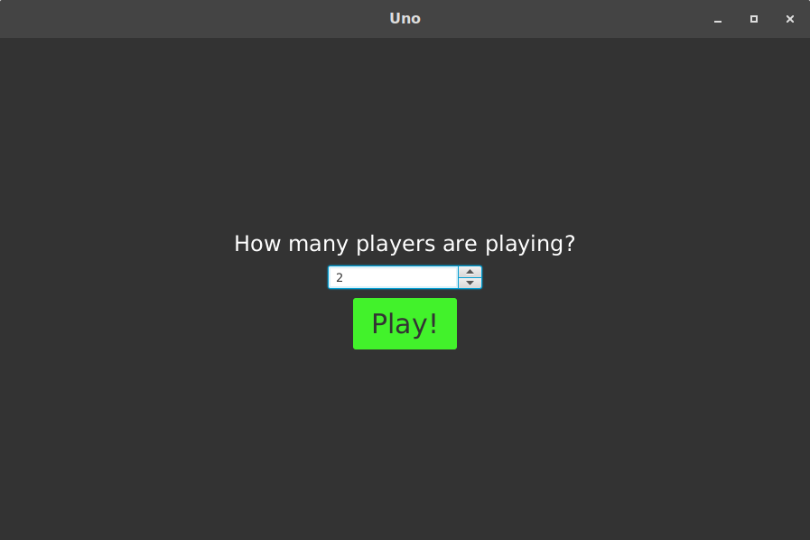
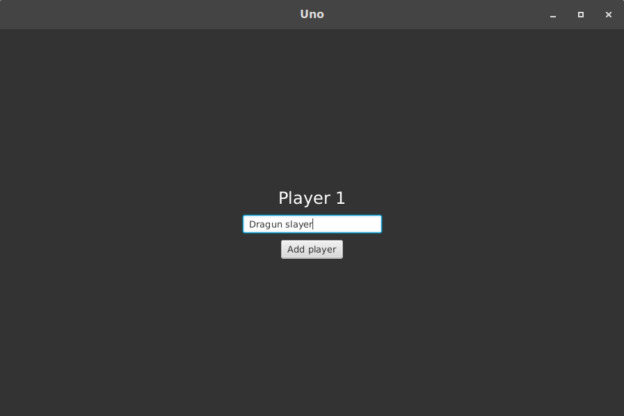
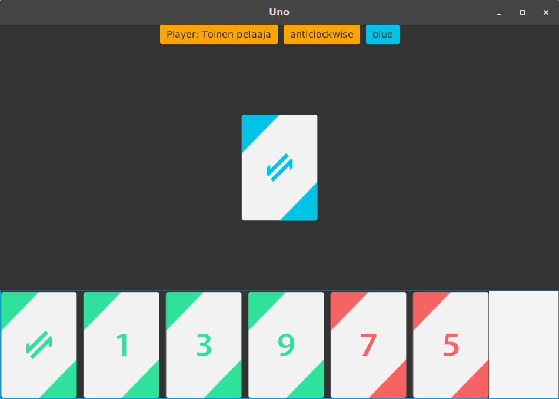
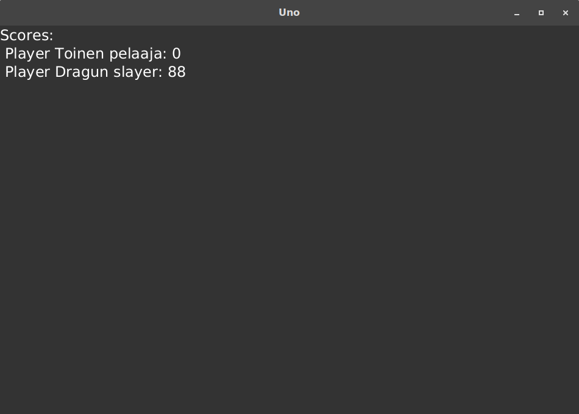

# Käyttöohje

## Konfigurointi
Sovellus ei tarvitse vielä erillistä konfigurointia. Pelaajamäärän ja pelaajien nimet asetetaan käyttöliittymän kautta.

## Sovelluksen käynnistäminen

### Aloitusnäkymä
Aloitus näkymässä valitset montako pelaaja on mukana

### Pelaajien nimien syöttö

### Pelinäkymä

### Tulosnäkymä

