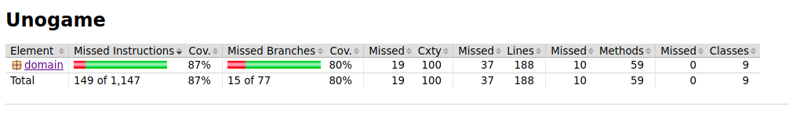

# Testausdokumentti

Testaus on suoritettu yksikkötesteillä ja integraatiotesteillä JUnitin avulla ja manuaalisesti järjestelmätason testeillä.

## Yksikkö- ja integraatiotestaus

### Sovelluslogiikka

Sovelluslogiikan testaus muodostuu [domain](https://github.com/k0tix/ot-harjoitustyo/tree/master/Unogame/src/main/java/domain) pakkauksen luokkia testaavat [UnoTest](https://github.com/k0tix/ot-harjoitustyo/blob/master/Unogame/src/test/java/domain/UnoTest.java) ja [ScoreBoardTest](https://github.com/k0tix/ot-harjoitustyo/blob/master/Unogame/src/test/java/domain/ScoreBoardTest.java) joiden testitapaukset simuloivat [Uno](https://github.com/k0tix/ot-harjoitustyo/blob/master/Unogame/src/main/java/domain/Uno.java)-olion suorittamia toiminnallisuuksia.

Luokille [Card]() ja [Deck]() on tehty yksikkötestejä joita integraatiotestit eivät testaa.

### Testauskattavuus

Sovelluksen testauksen rivikattavuus on 87% ja haarautumakattavuus 80%. Käyttöliittymäkerrosta testattiin manuaalisesti, eikä sille ole automaattisia testejä.

## Järjestelmätestaus

### Asennus ja konfigurointi

Sovelluksen asennusta ja konfigurointia on testattu Linux-ympäristössä käyttöohjeissa määritetyllä tavalla. Sovellus ei tarvitse erillistä konfiguraatiota.

### Toiminnallisuudet

Toiminnallisuuksia on testattu eri syötteillä ja tilanteilla manuaalisesti ja automaattisilla testeillä. Syötteeksi on yritetty antaa epäkelpoja syötteitä esimerkiksi kirjaimia numerokenttään, sekä yrittämällä pelata vääriä kortteja pelilaudalle.